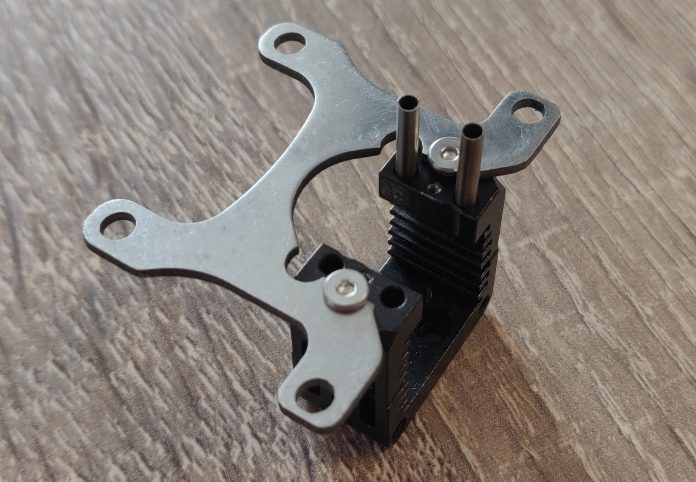

## Mosquito net

## What is it?
Upgrade your toolhead with Mosquito hotend by adding this custom plate. The plate will stiffen the lower part of the toolhead resulting in cleaner input shaper results, sharper printed corners and improved layerstacking.

The plate can be obtained as PCB (1.6mm thick) or lasercut from stainless or titanium (1.2/1.5/1.6mm thick). You will need 2 M2.5x4 low profile bolts to mount the plate to the heatsink as pictured below. Longer bolts will make assembly more difficult because of interference issues with the heaterblock. Additionally an eDrawing is supplied to help. Special thanks to all testers who helped the design become proven and as solid as it is today.

## For questions and suggestions contact @papejelly on the Annex Discord. 

