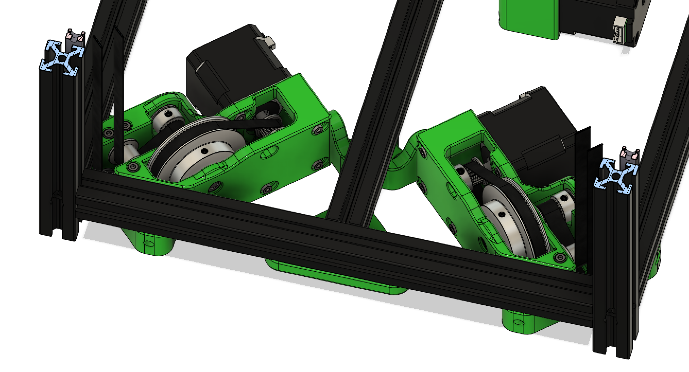
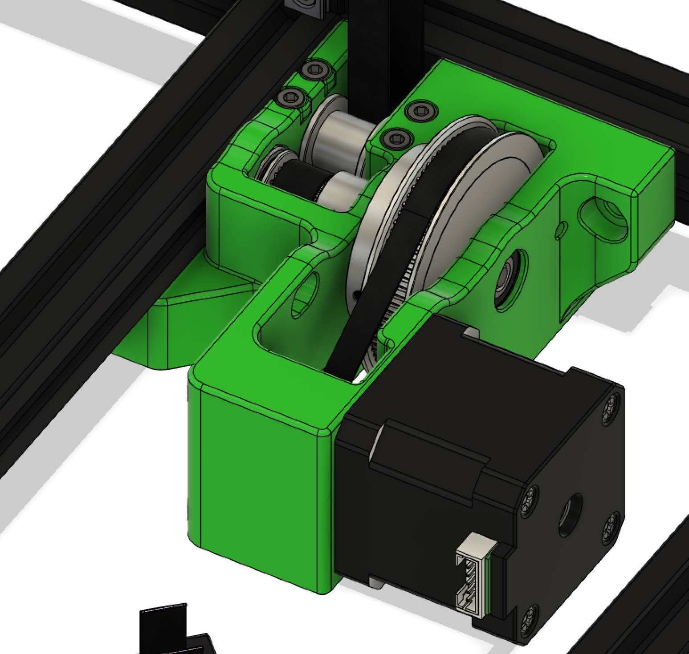
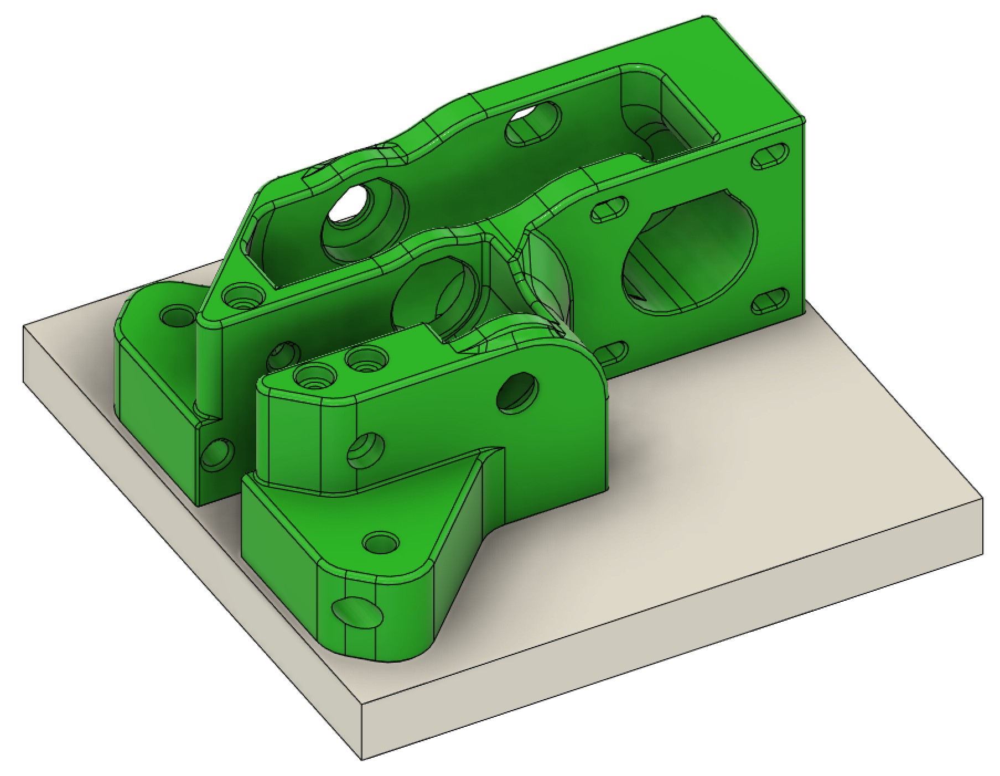
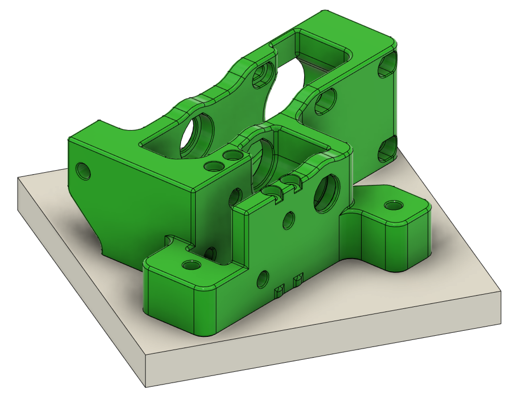

# K3 Z Drives Sized for a 120x120mm Bed

These files are Belted Z Drives modified to fit on a 120x120mm bed.  The Center Brace for the front drives is REQUIRED as there are only 2 bolts holding the front Z drives to the frame.

Print one of each file in this directory, including:
* `Z Drive, Front (120 Bed) v1 (Mirror).stl`
* `Z Drive, Front (120 Bed) v1.stl`
* `Z Drive, Front Brace (Dual Screw) v1.stl`
* `Z Drive, Rear (120 Bed) v1.stl`

This will replace the following files from the `3Z_Drive_Components` directory:
* `z_drive_front_left_x1_revX.stl`
* `z_drive_front_right_x1_revX.stl`
* `z_drive_rear_x1_revX.stl`
* `[a]_z_drive_front_brace_x1_revX.stl`

# Print Orientation

The rear Z drive will need to be rotated 30° to fit.  The STL should already be rotated correctly.
