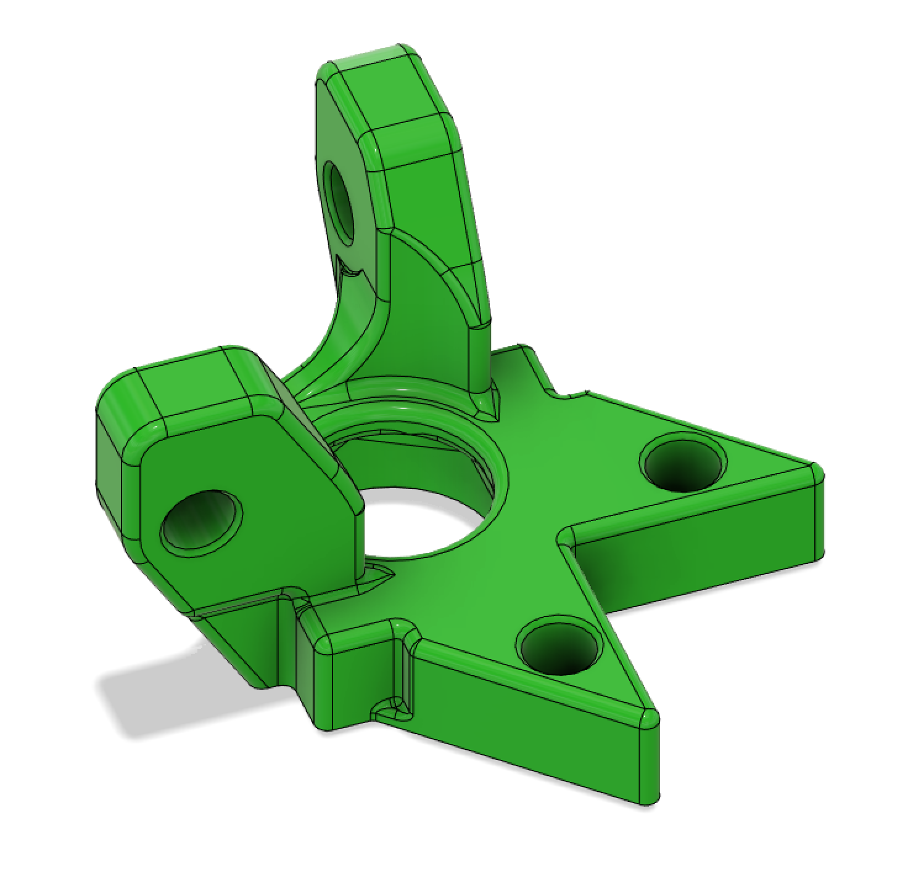

# Longboi Upper 625 Bearing Holder

This file allows for the XY Drive Upper 625 Bearing holders to be removed with the longboi custom k3 motors.

This should be able to use the regular endstops, but custom endstops should be made at some point.

This will replace `corner_motor_mount_2_piece_lower_x4_rev3.stl`.

