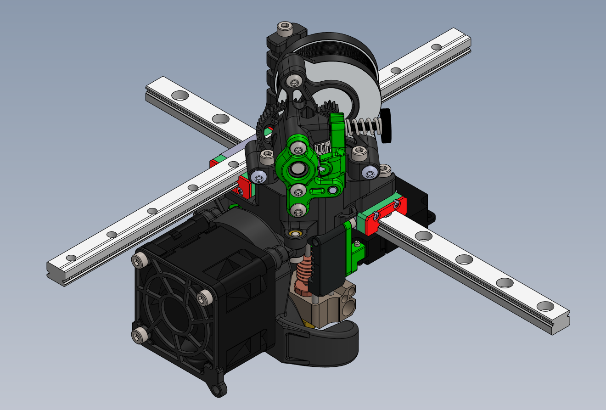

# K3 Frostbite Toolhead README

The Frostbite toolhead uses a 4028 axial fan to give more cooling performance than the dual 4010 blower option.

## Useful Notes

- Bowden tube length, endstop positions, and travel limits remain the same as for the dual 4010 toolhead.
- New probe offset: X-25.0 Y18.88
    - Since the probe offset has changed from the dual 4010 toolhead, you will need to replace the `[dockable_probe]` and `[z_tilt]` sections in your klipper config file with the snippets provided in the `Klipper_Config` folder. If you are not using a spider mainboard, you may have to change the `pin`.
- Replace the `[fan]` section in your klipper config file with the snippet provided in the `Klipper_Config` folder if you were not previously using a fan with hardware pwm. If you are not using a spider mainboard, you may have to change the `pin`. Before wiring your fan, make sure to check the datasheet for your fan to see which wire should be used for pwm.

## K3rabiner

Currently, the alpha 1 k3rabiner is partially supported with sherpa mini: you will need to omit the front connectors from the board and solder the wires directly (unless you are using a longer hotend such as the VolcoMosq or Dragon UHF). If you choose to use the k3rabiner, make sure to print the "main_body" and "spacer" files from the `k3rabiner` folder instead of the "main_body" file listed below.

## What to print

Please print all parts in the "common parts" section, the section for your chosen hotend, the section for your chosen extruder, and the section for your chosen probe mount:

### Common parts

- `frostbite_duct_x1`
- `frostbite_guard_x1`

### Hotends

Slice Mosquito
- main body (depends on your extruder):
    - Sherpa Mini: `sherpa_mini_mosquito_main_body_x1`
    - Sherpa Micro: `sherpa_micro_mosquito_main_body_x1`
    - Ascender: `ascender_mosquito_main_body_x1`
- `mosquito_hotend_fan_duct_x1`
- `k3_left_bracket_x1`

VolcoMosq
- main body (depends on your extruder):
    - Sherpa Mini: `sherpa_mini_mosquito_main_body_x1`
    - Sherpa Micro: `sherpa_micro_mosquito_main_body_x1`
    - Ascender: `ascender_mosquito_main_body_x1`
- `mosquito_hotend_fan_duct_x1`
- `k3_left_bracket_extended_8.5mm_x1`

Dragon-Style Hotend
- main body (depends on your extruder):
  - Sherpa Mini: `sherpa_mini_dragon_main_body_x1`
  - Sherpa Micro: `sherpa_micro_dragon_main_body_x1`
  - Ascender: `ascender_dragon_main_body_x1`
- `dragon_hotend_fan_duct_x1`
- `k3_left_bracket_x1`

Dragon UHF (with nozzle extender)
- main body (depends on your extruder):
  - Sherpa Mini: `sherpa_mini_dragon_main_body_x1`
  - Sherpa Micro: `sherpa_micro_dragon_main_body_x1`
  - Ascender: `ascender_dragon_main_body_x1`
- `dragon_hotend_fan_duct_x1`
- `k3_left_bracket_extended_17mm_x1`

Dragon UHF (without nozzle extender)
- main body (depends on your extruder):
  - Sherpa Mini: `sherpa_mini_dragon_main_body_x1`
  - Sherpa Micro: `sherpa_micro_dragon_main_body_x1`
  - Ascender: `ascender_dragon_main_body_x1`
- `dragon_hotend_fan_duct_x1`
- `k3_left_bracket_extended_8.5mm_x1`

### Extruders

Sherpa Mini
- `sherpa_umbilical_mount_x1`
- (sherpa mini extruder with k-series front housing)

Sherpa Micro
- `sherpa_umbilical_mount_x1`
- (sherpa micro extruder with k-series front housing)

Ascender
- `ascender_umbilical_mount_x1`
- (double folded ascender extruder - R4 or newer)

### Probe mounts

QD1
- `qd1_probe_mount_x1`

QD2
- `qd2_probe_mount_x1`
