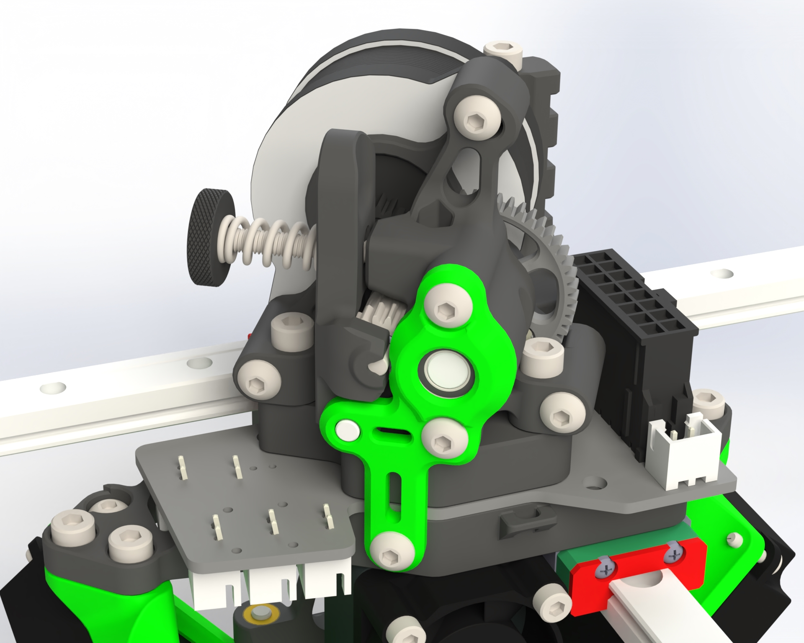

# K3rabiner-Toolboard

The K3rabiner is a toolboard for the K3 and an easy & quick connection between the backpack and toolhead. Thanks to wendemann for the original work.

## Features

- Supports Sherpa mini/micro ONLY
- Input via 16pin horizontal microfit
- Output for partcooling fans
- Soldered seperate voltage selection for hotend fan and partcooling fan
   - Uses either the hotend voltage or one alternative voltage

## Latest information
The latest information related to the pcb can be found [HERE.](https://github.com/Annex-Engineering/Annex_Engineering_PCBs/tree/master/carabiner-series-toolboard/k3rabiner)

## Sourcing
Links to purchase fully assembled boards can be found here: [ANNEX Sourcing Guide](https://docs.google.com/spreadsheets/d/1aSM1jGxg-s0tyynyR3f8M0IQMXuXw57RJvoJbt98Clw/edit?usp=sharing)

## Gallery

Sherpa Micro Alpha 2

Sherpa Mini Alpha 2

