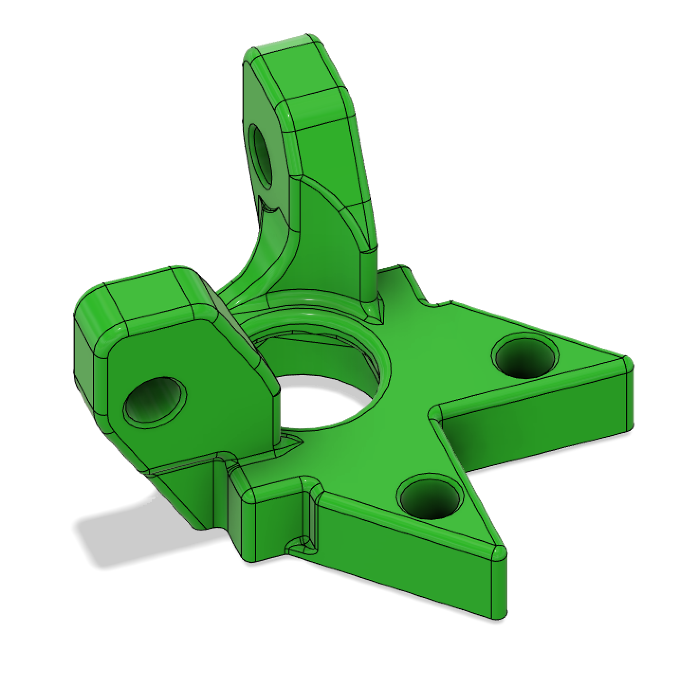

# Longboi Upper 625 Bearing Holder

This file allows for the XY Drive Upper 625 Bearing holders to be removed with the longboi custom k3 motors.

This is not compatible with the standard endstop. There are custom endstops for this mod in the discord.

This will replace `corner_motor_mount_2_piece_lower_x4_rev3.stl`.

