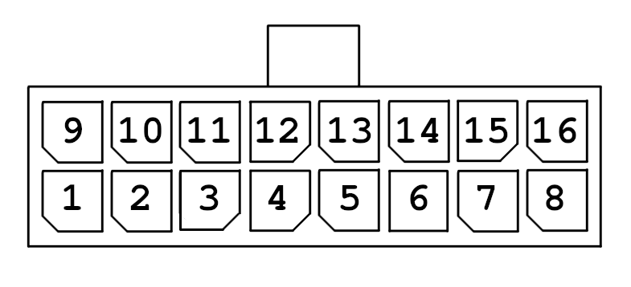
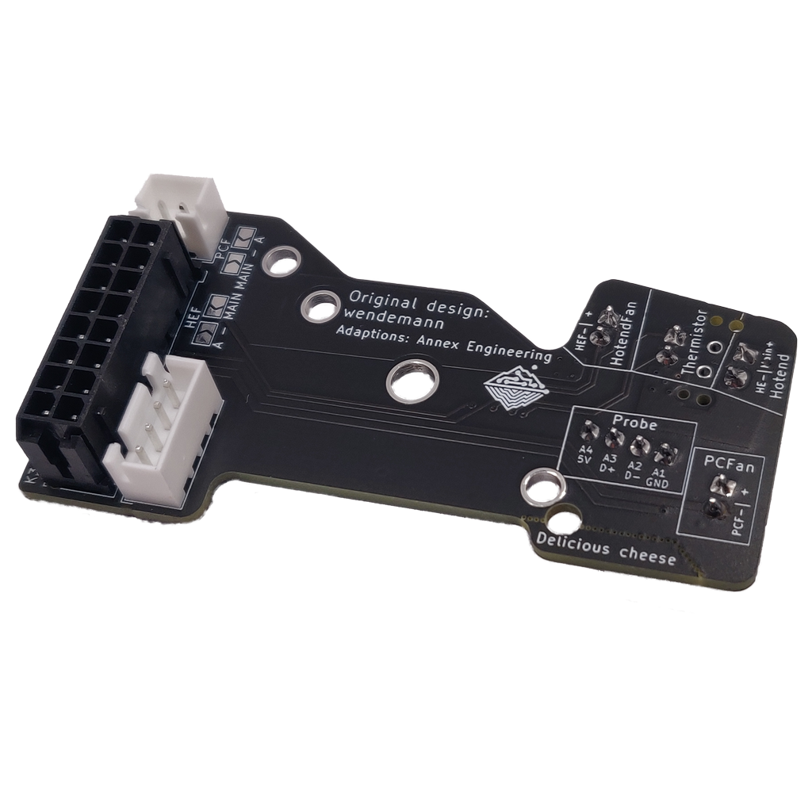

# K3rabiner-Toolboard

The K3rabiner is a toolboard for the K3 and an easy & quick connection between the backpack and toolhead. Thanks to wendemann for the original work.

## Features

- Supports Sherpa mini/micro ONLY
- Input via 16pin horizontal microfit
- Output for partcooling fans
- Soldered seperate voltage selection for hotend fan and partcooling fan
   - Uses either the hotend voltage or one alternative voltage

## Connectors & Amperage

_Note: All amperage-values have been designed to work in an enclosed printer with up to 65° chamber temperature & have  some safety margins. While you could use higher ampere in an open-frame printer, it's highly discouraged.  
When multiple connectors are supported **bold** marks the recommended connector._

|   | Supported Connectors | Maximum Ampere |
| ------------- | ------------- | ------------- | 
| Hotend  | 2-pin JST XH   Microfit 430450227   **Microfit 436500227** (compatible with e3d heater) | ~2 Ampere (50W heater on 24V)   4.2 Ampere (100W heater on 24V)  4.2 Ampere (100W heater on 24V)
| Hotend Thermistor  | 2-pin JST XH   **Microfit 436500227** (compatible with e3d thermistor) | /   /
| Hotend Fan | 2-pin JST XH | 1 Ampere
| Partcooling Fan | 2-pin JST XH | 2 Ampere
| Stepper | 4-pin JST XH | 1.2 Ampere   0.84 Ampere on TMC drivers as you specify the RMS ampere which is ~70% of peak
| Aux / Probe | 4-pin JST XH | 0.8 Ampere

## Sourcing
Links to purchase fully assembled boards can be found here: [ANNEX Sourcing Guide](https://docs.google.com/spreadsheets/d/1aSM1jGxg-s0tyynyR3f8M0IQMXuXw57RJvoJbt98Clw/edit?usp=sharing)

Be aware that K3rabiner B0.1 and up have 3 different options for Heater and Thermistor connectors:

## Wiring Guide

This pinout assumes you're looking directly at the cable. 

| PinNumber | Usage | PinNumber | Usage |
|-------------|:-------------:| ------------- |:-------------:|
| 1  |  Thermistor Chamber | 9 | Hotend Voltage
| 2  | Partcooling Fans Ground | 10 | Hotend Ground
| 3  | Hotend Fan Ground | 11 | Alt Voltage
| 4  | Thermistor Common Ground | 12 | Thermistor Hotend
| 5  | Motor A | 13 | Motor C
| 6  | Motor B | 14 | Motor D
| 7  | Aux 1 | 15 | Aux 2
| 8  | Aux 4 | 16 | Aux 3

## Gallery

