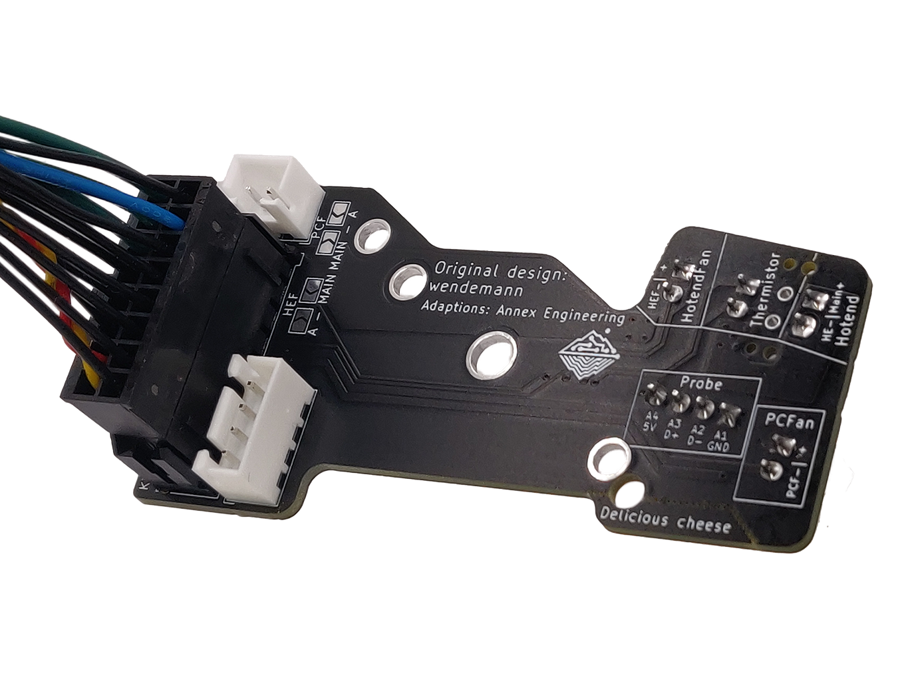
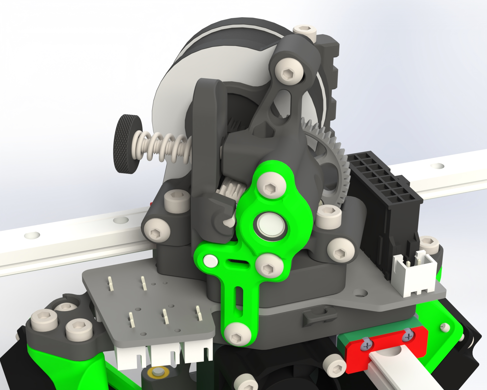
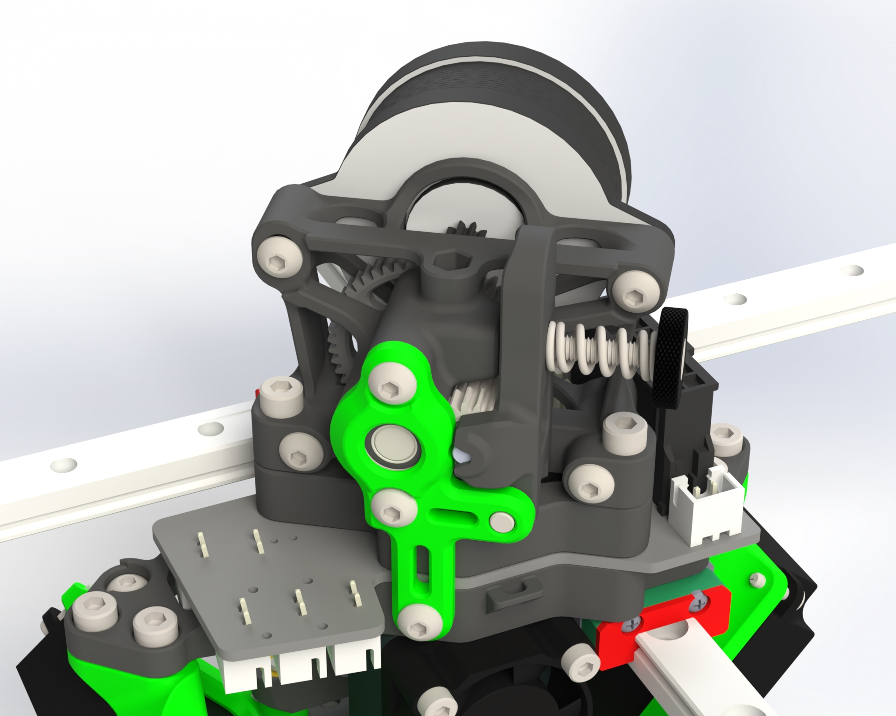

# K3rabiner-Toolboard

The K3rabiner is a toolboard for the K3 and an easy & quick connection between the backpack and toolhead. Thanks to wendemann for the original work.

## Features and Notes

- K3rabiner will be the toolhead path moving forward, all future designs will use it in some form or another due to packaging constraints. This may result in support for some hotends being dropped and/or some extruders being temporarily unsupported (folded ascender) while we get our shit together.
- Supports Sherpa mini/micro ONLY
- Input via 16pin horizontal microfit
- Output for partcooling fans
- Soldered seperate voltage selection for hotend fan and partcooling fan
   - Uses either the hotend voltage or one alternative voltage

## Latest information
The latest information related to the pcb can be found [HERE.](https://github.com/Annex-Engineering/Annex_Engineering_PCBs/tree/master/carabiner-series-toolboard/k3rabiner)

## Sourcing
Links to purchase fully assembled boards can be found here: [ANNEX Sourcing Guide](https://docs.google.com/spreadsheets/d/1aSM1jGxg-s0tyynyR3f8M0IQMXuXw57RJvoJbt98Clw/edit?usp=sharing)

## Gallery

K3rabiner with the Sherpa Micro

K3rabiner with the Sherpa Mini

